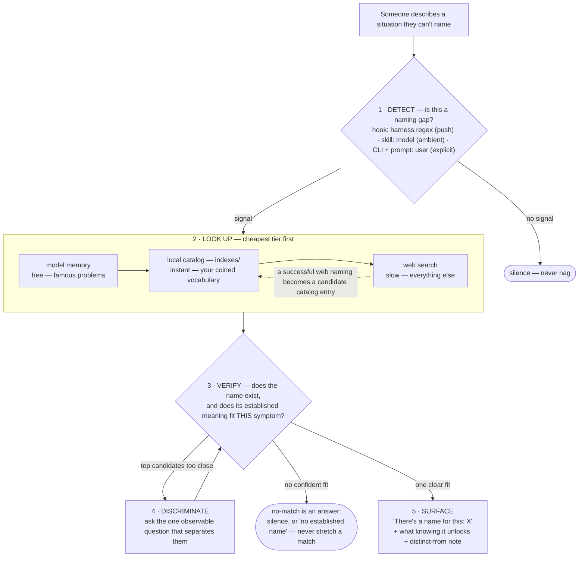

# problem-namer

**Notices when you're describing a named problem without knowing its name, and tells you what it's called.**

The moment something has a canonical name — the winner's curse, the N+1 query
problem, Simpson's paradox — you can search it, read decades of prior art,
and check the claim yourself. This repo packages that move for AI-assisted
work. The full argument, the measurements, and the story behind it are in
**[Is There a Name for This?](docs/theres-a-name-for-this.md)** — this README
is the manual.

## Try it (no setup, no LLM)

```
node match.mjs "our dashboard metric became the target everyone optimizes and it keeps climbing while the actual quality it was a proxy for gets worse"
```

```
Goodhart's Law  [statistics]  (score 13.5)
  symptom: A number that used to be a reliable indicator becomes an official target, and soon people
  optimize it directly—so it climbs while the underlying thing it was supposed to reflect stagnates
  or worsens.
  unlocks: 'When a measure becomes a target, it ceases to be a good measure': the proxy decouples
  from the true objective; the fix is multiple/rotating metrics, guardrail measures, and rewarding
  the outcome rather than the proxy.
```

The CLI falls back to [`examples/problems.json`](examples/problems.json) — a
189-entry catalog of named problems across software, distributed systems,
statistics, economics, ML, and operations — when `indexes/` is empty.

## Architecture

One core (`core/matcher.mjs`: catalog loader + IDF scorer, ~80 lines,
zero dependencies) and thin adapters, split by **who notices the naming gap**:

| Adapter | Who notices | What it is |
|---|---|---|
| [`adapters/claude-code-hook/`](adapters/claude-code-hook/problem-namer.mjs) | **The harness** (push — fires even when nobody thought to ask) | Claude Code `UserPromptSubmit` hook: instant regex + lexical gates, injects candidates or a name-it-yourself nudge |
| [`adapters/mcp/`](adapters/mcp/server.mjs) | **The model**, mid-task (pull) | MCP server (stdio, zero deps): `name_problem` tool with explicit no-match, catalogs as resources, `name-this` prompt |
| [`adapters/skill/`](adapters/skill/problem-namer/SKILL.md) | **The model**, from an ambient description | The surfacing protocol as an Agent Skill — find, verify, discriminate, or stay silent |
| [`match.mjs`](match.mjs) | **You**, explicitly | Zero-dependency CLI: describe the situation, get candidates |

Every adapter feeds the same pipeline (it's differential diagnosis — see
[the article](docs/theres-a-name-for-this.md) for why):



**Out of the box the framework ships zero knowledge**: detection + the model's
own memory + web-search verification. Drop `*.json` catalogs into `indexes/`
to add the fast local tier — the only tier that works for vocabulary the
model can't know (your team's own coined terms). One line enables the example
catalog:

```
cp examples/problems.json indexes/
```

## Install

**Claude Code hook** — clone the repo anywhere, then in `~/.claude/settings.json`:

```json
{
  "hooks": {
    "UserPromptSubmit": [
      { "hooks": [{ "type": "command", "command": "node /path/to/problem-namer/adapters/claude-code-hook/problem-namer.mjs" }] }
    ]
  }
}
```

Runs in single-digit milliseconds on every prompt, exits silently on anything
unexpected. Two precision gates before it says a word; the model makes the
final call, and the injected instruction ends with *"never force a match; a
wrong name is worse than silence."*

**MCP server** — works in any MCP client:

```
claude mcp add problem-namer -- node /path/to/problem-namer/adapters/mcp/server.mjs
```

Exposes the `name_problem` tool (ranked candidates with distinguishing notes,
or an **explicit no-match** — never a forced closest pick), every catalog as
a readable resource, and a user-invokable `name-this` prompt.

**Skill** — copy `adapters/skill/problem-namer/` into your skills directory
(e.g. `~/.claude/skills/`).

## The catalog format

```json
{
  "field": "distributed systems and concurrency",
  "name": "Livelock",
  "aliases": ["live-lock"],
  "symptom": "Threads are busy and CPU is pegged, yet no work advances; each keeps reacting to the others and retrying...",
  "framework": "Introduce asymmetry or randomness: jittered backoff, priorities, a single arbiter...",
  "distinguish": ["Deadlock: threads are blocked and idle, not busy"]
}
```

- **`symptom`** is the retrieval surface, deliberately written the way a
  person describes it *before* they know the name.
- **`framework`** is what knowing the name unlocks — the canonical analysis
  or fix.
- **`distinguish`** separates confusable neighbors at selection time.

Drop any number of `*.json` files into `indexes/` — every adapter loads them
all.

### Build an index for your own vocabulary

This is where the measured lift is biggest (see the results below): terms
that exist only in your team's docs, which neither the model nor the web can
know.

1. Walk your internal docs and extract every deliberately coined term.
2. For each, write the `symptom` as a person would describe it **without**
   the term.
3. Add `distinguish` notes between entries that keep colliding.
4. Check retrieval with `match.mjs` using paraphrases, not the original
   definitions.

## Measured results

Paired eval of the **catalog tier** (RAW from memory vs. +INDEX), scenarios
written symptom-first, `claude-haiku-4.5`; runner is provider-neutral (any
OpenAI-compatible endpoint):

| benchmark | n | RAW | +catalog | helped / hurt | McNemar p |
|---|---|---|---|---|---|
| famous problems (pooled dev+holdout) | 80 | 74% | 90% | 17 / 4 | ≈ 0.007 |
| private project vocabulary | 54 | 22% | 62% | 23 / 1 | < 0.001 |

The lift lives exactly where the knowledge isn't already in the model; the
web-search default path is not yet benchmarked; the 4/80 hurt cases are why
everything defaults to silence. Full discussion in
[the article](docs/theres-a-name-for-this.md).

Reproduce:

```
PN_API_KEY=... PN_MODEL=gpt-4o-mini node eval/run.mjs --split=holdout
```

## License

MIT
